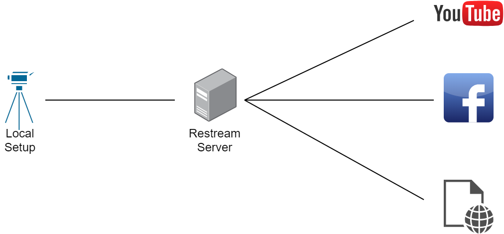
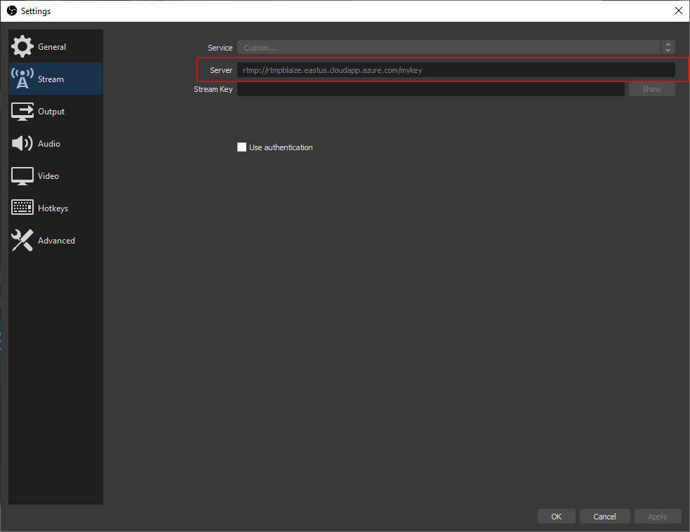
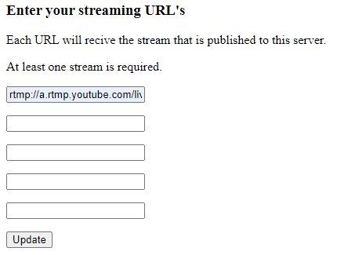

## NGINX Based Restream Server for RTMP

Live streaming is nothing new and the ecosystem has matured. Nowadays, most social media platforms (including YouTube and Facebook) and a few point solutions for live streaming have emerged to provide live streaming services to whoever wants to use them. Many people though want to be able to stream to multiple platforms simultaneously. The problem though is that many software packages, such as OBS, do not support this as a feature, so it creates the need to create a proxy that will receive a live stream and essentially fork it so that it can be sent to multiple services, a concept known as restreaming.



For some, paying for a service is acceptable because it offers an easy to use interface that connects to multiple live streaming platforms. For others like me, they would rather stand something up in the cloud and do it yourself. The problem with many of the tools for this though, is that they are fairly heavy and are really too much for simply restreaming. There is one tool, however, that is fast and lightweight but it’s not really that easy to use, namely the [RTMP plugin for NGINX](https://www.nginx.com/products/nginx/modules/rtmp-media-streaming/). 

This project grew out of a twofold need. One was to automate the build and condquently provide a build as a container image. Two, the solution needed to be easy to deploy and manage. By deploying this as a container, creating an instance of the server is easy and hosted with the container is an adming page that give the user a GUI to update the restream endpoints. 

### Run as a Docker Container

To run this as a Docker container, simply use a Docker run command.

```
docker run -it -p 1935:1935 -p 443:443 -e STREAMS=rtmp://stream1/key;rtmp://stream2/key;  -e RTMPSECRET=yoursecretkey PASSWORD=password123 blaize/nginx-rtmp
```

The -e parameters define the deployment. If you have Docker for Desktop installed, you can run this locally.

* STREAMS: This is a semicolon (;) delimited list of your restream targets. This are typically retrievable from the dashboards from the streaming platform and will also require a key. The URL is typically some URL followed by a slash (/) then your key. For instances, YouTube would be rtmp://a.rtmp.youtube.com/live2/your-key-hear

* RTMPSECRET: This is a key that you generate. It will be postpended to the IP or hostname of your host after a slash (ie rtmp://host/yourey). This should be a key that is not easily guessed so nobody to can get to your stream/

* PASSWORD: This is a password used to access to the admin web page to update the streams. Whenever the container starts, it also starts a website on port 443 that can be accessed through a browser so the user can update restream URL's if they change.

### Deploy to Azure

If you want to easily deploy this to Azure, you can deploy the Azure Resource Manager (ARM) template by clicking the button below.

Once you're in the Azure Portal, you can fill out the form to deploy this to Azure.


* Subscription -- You Azure subscription

* Resource Group -- Either choose and existing resource group or create a new group to deploy the server.

* Location -- Choose the Azure region to deploy the server.

* Admin Password -- The password to access to VM through SSH and to access to the Admin page.

* Streams -- The intial streams to restream to. Use a semicolon delimited list for each of your Live Stream platforms.

* DNS Name For Publoc IP -- Azure will assign a name that will be `yourname.azureregion.cloudapp.azure.com` where `yourname` is the value of the this field and `azureregion` is the region you deployed the server to.

Finally, agree to the terms and conditions and click `Purchase` to start the deployment.

### Connect to Server with OBS

OBS is probably the most popular live streaming software and works without any issues with this configuration. To configure OBS, select `Settings`, then under `Stream` enter in `rtmp://host/key` where `host` is the hostname of your container or VM running the restreatm server and `key` is the key you configured the restream server with.




### Updating the Restream Endpoints

You can update the restream endpoints for the server through the admin page. Navigate to `https://host/index.sh` where `host` is the IP address or hostname for your server. You may get a certificate error. Simply ignore this. After ignoring the certificate error, logon to the server with the username `admin` and the password that you entered when you configured the server.



Enter in the rmtp enpoionts you want to stream to, then click `Update`. This will reconfigure the server to restreatm to the new endpoints.